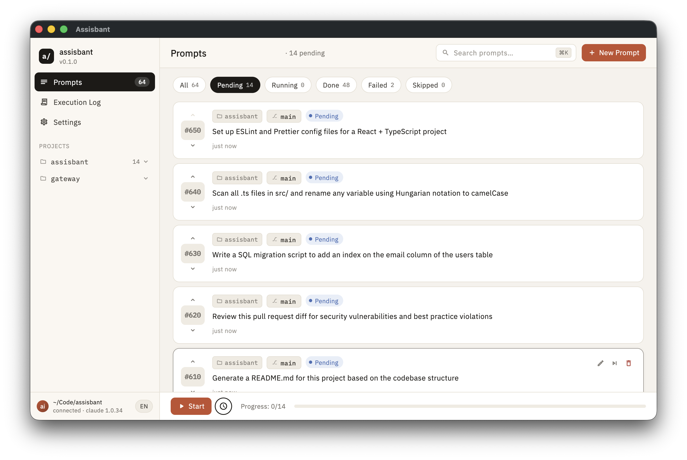
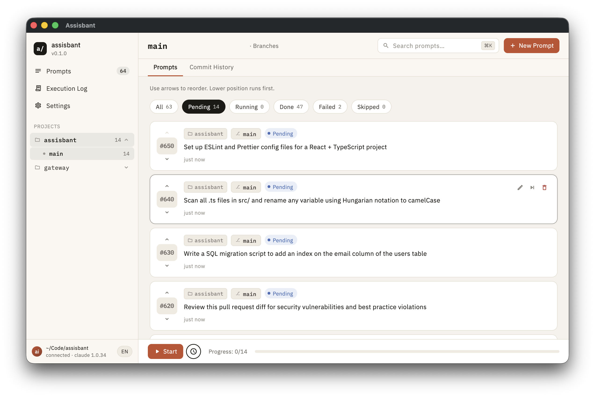
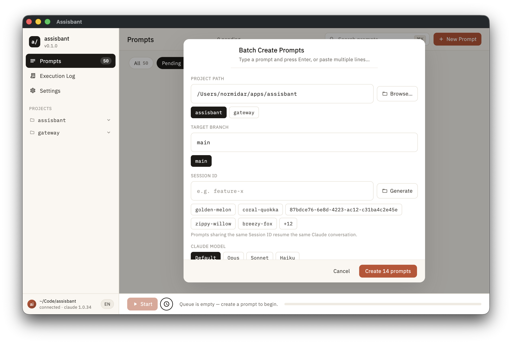
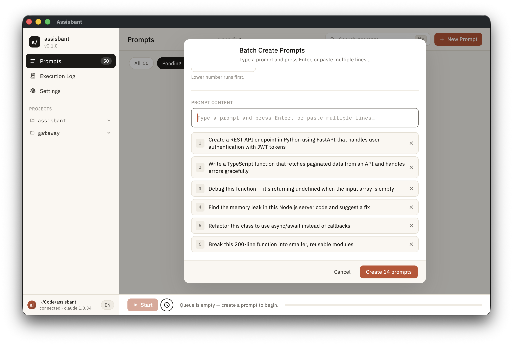
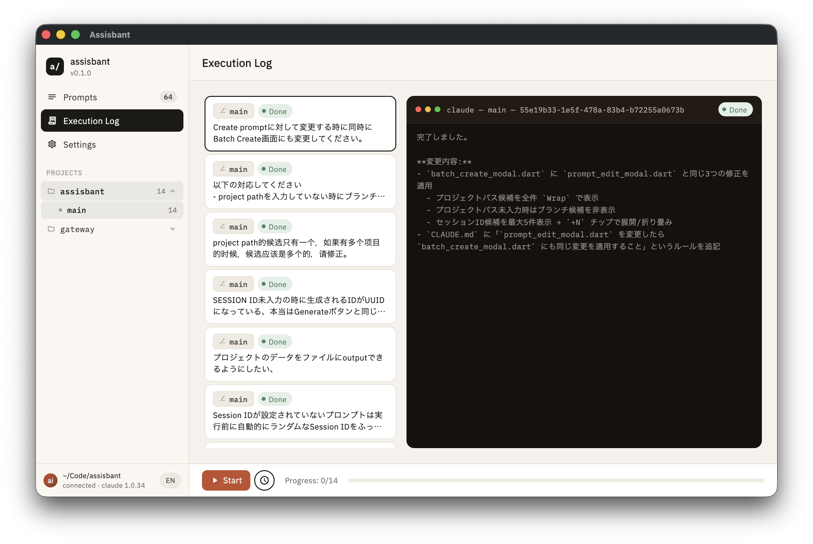
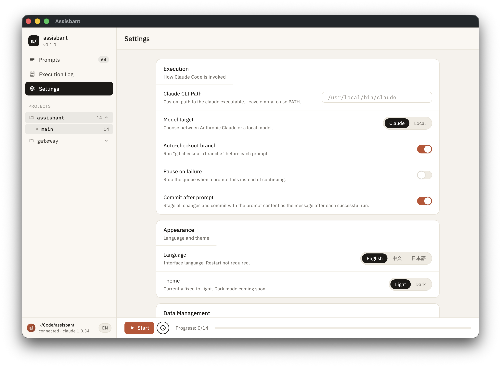

# assisbant

**A macOS desktop app to manage and batch-execute Claude Code prompts across git branches.**

[](https://flutter.dev)
[](https://developer.apple.com/macos/)
[](LICENSE)

> Turn your Claude Code workflow into a managed queue — create prompts, assign branches, set priorities, and let assisbant handle the rest automatically.

---

### Run hundreds of AI tasks — unattended, around the clock

Got a local model and a backlog of 200 coding tasks? **assisbant is built for this.**

Queue them all up before you go to bed. Wake up to a full execution history, per-task logs, and a color-coded status board showing exactly what passed and what needs a second look. No terminal babysitting. No manual branch switching. Just results.

> "Set it and forget it" for AI-assisted development — ideal for local LLM setups (Ollama, LM Studio, llama.cpp) running 24/7 without rate limits or API costs.

---

## What is assisbant?

When you work with [Claude Code](https://claude.ai/code), you often want to run multiple prompts across different feature branches — one after another, without babysitting the terminal. **assisbant** gives you a visual queue manager for exactly that.

- Write your prompts in advance with a target branch and priority
- Hit "Run" — the app executes them one by one via `claude --print`
- Watch live output stream in a built-in terminal view
- Come back to a clean summary of what passed, what failed, and the full logs

---

## Screenshots













---

## Features

### Prompt Queue Management
- Create prompts with **content**, **target branch**, and **priority**
- Drag to reorder execution priority
- **Batch create** — paste a list of lines, each becomes a prompt instantly
- Skip individual prompts without deleting them
- Reset completed/failed prompts back to pending

### Execution Engine
- Runs `claude --dangerously-skip-permissions --print "<content>"` sequentially
- **Auto-checkout** — switches git branches automatically before each prompt
- **Pause on failure** — halts the queue if a prompt fails, so you can inspect and resume
- Real-time stdout/stderr streaming to the in-app terminal view
- Per-prompt `projectPath` overrides the global working directory

### Branch View
- Visual grid of all branches with color-coded progress bars
- At a glance: how many prompts are pending / done / failed per branch
- Click a branch to filter the prompts list instantly

### Session Tracking
- Assign a **Session ID** to group related prompts (auto-generated creative names like `silver-fox` or `morning-maple`)
- Filter and search by session ID, branch, or project path
- `claudeSessionId` stored per-prompt for cross-referencing Claude Code runs

### Execution Logs
- Dedicated Logs screen with a terminal-styled viewer
- Full stdout/stderr history per prompt
- Selectable text for copy-paste

### Settings
| Setting | Description |
|---|---|
| CLI Path | Path to your `claude` executable |
| Working Directory | Default directory for `git checkout` and prompt execution |
| Auto-checkout | Automatically switch branches before each prompt |
| Pause on Failure | Stop the queue when a prompt fails |
| Language | English / 中文 / 日本語 |
| Theme | Light / Dark |

---

## Installation

### Requirements

- macOS 12+
- [Flutter](https://flutter.dev) (or [FVM](https://fvm.app) — recommended)
- [Claude Code CLI](https://claude.ai/code) installed and in your PATH

### Build from source

```bash
# Clone the repository
git clone https://github.com/normidar/assisbant.git
cd assisbant

# Install FVM (Flutter Version Manager) if needed
dart pub global activate fvm
fvm install

# Get dependencies
fvm flutter pub get

# Run code generation (Drift + Riverpod)
fvm dart run build_runner build --delete-conflicting-outputs

# Build for macOS
fvm flutter build macos

# Or run in development mode
fvm flutter run -d macos
```

The built app appears at `build/macos/Build/Products/Release/assisbant.app`.

---

## Usage

### 1. Configure the CLI path

Open **Settings** and set the path to your `claude` executable (default: `/usr/local/bin/claude`) and the working directory (your git repo root).

### 2. Create prompts

Click **+ New Prompt** on the Prompts screen. Fill in:
- **Content** — the instruction you'd pass to Claude Code
- **Branch** — git branch to run it on
- **Priority** — higher numbers run first
- **Session ID** — optional grouping label
- **Project Path** — overrides global working directory for this prompt

### 3. Batch create

Click **Batch Create** to paste or type multiple prompts at once — one per line — and add them all in one shot.

### 4. Run the queue

Press **Run** in the bottom execution bar. assisbant will:
1. Sort pending prompts by priority (descending)
2. For each prompt: optionally `git checkout <branch>`, then call `claude --print "<content>"`
3. Stream output live, store results in SQLite
4. Mark each prompt Done or Failed

### 5. Review results

Switch to the **Logs** tab for a searchable history of all executions with full output.

---

## Architecture

```
UI (screens/ + widgets/)
  └── Riverpod providers (state/)
        └── Repositories & Services (data/)
              └── SQLite (Drift) + claude CLI process
```

| Layer | Technology |
|---|---|
| UI | Flutter + Material 3 |
| State | Flutter Riverpod (manual + generated) |
| Database | Drift (SQLite, schema v5) |
| Persistence | SharedPreferences (settings) |
| i18n | Custom `AppStrings` (EN / ZH / JA) |
| CLI integration | `dart:io Process.start` streaming |

---

## Development

```bash
make get        # fvm dart pub get
make build      # build_runner codegen (run after schema / @Riverpod changes)
make analyze    # dart analyze
make format     # dart format + markdown prettier
make ci         # full CI pipeline
```

**Tests:**
```bash
fvm flutter test
```

Drift tests use an in-memory database — no external setup needed.

---

## Contributing

Pull requests are welcome! Before contributing, please:

1. Run `make ci` and ensure it passes
2. Add or update tests for changed logic
3. Keep the architecture layered — UI must not call repositories directly

---

## License

MIT License. See [LICENSE](LICENSE) for details.

---

<p align="center">Built with Flutter for macOS · Powered by Claude Code</p>
