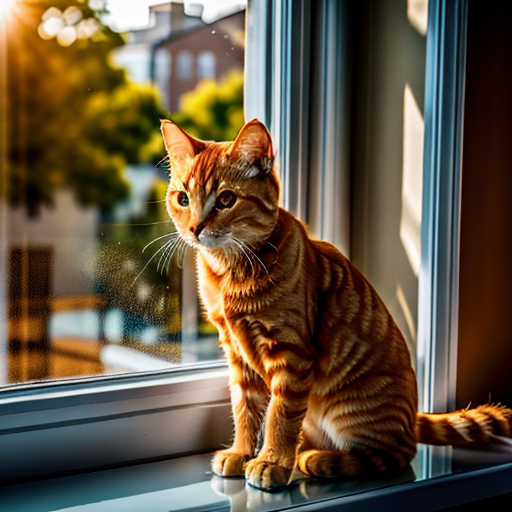

# stable_diffusion_ffi

Dart FFI バインディングで [stable-diffusion.cpp](https://github.com/leejet/stable-diffusion.cpp) を直接呼び出し、Web サービスなしで `.safetensors` / GGUF モデルから画像を生成するパッケージです。


> *"a cute orange tabby cat sitting on a windowsill, natural sunlight, sharp focus, photorealistic"*  
> Realistic Vision V6.0 B1 Q8_0 · 512×512 · 25 steps · Euler A · seed=1234 · CPU

---

## 特徴

- Automatic1111 などの Web API **不要** — モデルファイルを直接読み込んで推論
- `dart:ffi` + [stable-diffusion.cpp](https://github.com/leejet/stable-diffusion.cpp) C API を呼び出し
- `Isolate.run()` でバックグラウンド実行 → UI スレッドをブロックしない
- [Native Assets](https://dart.dev/tools/hooks) で `flutter build` 時に自動コンパイル（cmake が PATH に必要）
- macOS/iOS では Metal GPU アクセラレーションを自動で有効化
- SD 1.x / 2.x / XL / FLUX など、stable-diffusion.cpp がサポートするすべてのモデルに対応

---

## 前提条件

| ツール | 用途 |
|---|---|
| cmake ≥ 3.15 | ライブラリのビルド（Native Assets フック内で使用） |
| C++17 対応コンパイラ | macOS: Xcode / Linux: GCC or Clang / Windows: MSVC |
| Dart ≥ 3.3 | SDK バージョン要件 |

> **注意**: Native Assets を使う場合は `flutter build` / `dart build` 時にネットワーク接続不要ですが、サブモジュールのソースがローカルに存在している必要があります。

---

## セットアップ

### 1. pubspec.yaml に追加

```yaml
dependencies:
  stable_diffusion_ffi:
    path: packages/stable_diffusion_ffi  # パスは環境に合わせて変更
```

### 2. サブモジュールを初期化（初回のみ）

このパッケージは `src/stable-diffusion.cpp/` に stable-diffusion.cpp を **git サブモジュール** として含んでいます。クローン後に以下を実行してください。

```bash
git submodule update --init --recursive packages/stable_diffusion_ffi/src/stable-diffusion.cpp
```

### 3. ライブラリの用意

**方法 A — Native Assets で自動ビルド（推奨）**

`flutter build` または `dart build` 実行時に `hook/build.dart` が cmake を呼び出してライブラリを自動コンパイルします。`dylibPath` は空文字列のままにしてください。

```bash
# cmake が PATH に入っていることを確認
cmake --version

# Flutter でビルドするとフックが自動実行される
flutter build macos
```

**方法 B — 事前ビルド済みライブラリを使う**

```bash
git clone --recursive https://github.com/leejet/stable-diffusion.cpp
cd stable-diffusion.cpp
mkdir build && cd build
cmake .. -DSD_BUILD_SHARED_LIBS=ON -DCMAKE_BUILD_TYPE=Release -DSD_BUILD_EXAMPLES=OFF
cmake --build . --parallel
# bin/ 以下に libstable-diffusion.dylib / .so / .dll が生成される
```

生成されたライブラリのパスを `SdGenerateParams.dylibPath` に指定します。

---

## 使い方

```dart
import 'dart:io';
import 'package:stable_diffusion_ffi/stable_diffusion_ffi.dart';

Future<void> main() async {
  final result = await StableDiffusionFfi.generate(
    SdGenerateParams(
      modelPath: '/path/to/your-model.safetensors',  // または .gguf
      prompt: 'a beautiful landscape, golden hour, photorealistic',
      negativePrompt: 'blurry, low quality, ugly',
      width: 512,
      height: 512,
      steps: 20,
      seed: 42,  // -1 でランダムシード
    ),
  );

  await File('output.png').writeAsBytes(result.pngBytes);
  print('生成完了: ${result.width}x${result.height}, seed=${result.seed}');
}
```

### モデルのダウンロード例

**Realistic Vision V6.0 B1（フォトリアル特化、Q8_0 約 1.8 GB）** ← 上の画像の生成に使用

```bash
huggingface-cli download second-state/Realistic_Vision_V6.0_B1-GGUF \
  realisticVisionV60B1_v51HyperVAE-Q8_0.gguf --local-dir .
```

**SD 1.5 ベース（汎用、Q4_0 約 1.5 GB）**

```bash
huggingface-cli download second-state/stable-diffusion-v1-5-GGUF \
  sd-v1-5-q4_0.gguf --local-dir .
```

---

## API リファレンス

### `StableDiffusionFfi.generate(params)`

```dart
static Future<SdGenerationResult> generate(SdGenerateParams params)
```

バックグラウンド Isolate で画像生成を実行し、PNG バイト列を返します。

---

### `SdGenerateParams`

| パラメータ | 型 | デフォルト | 説明 |
|---|---|---|---|
| `modelPath` | `String` | **必須** | モデルファイルのパス（`.safetensors` または `.gguf`） |
| `prompt` | `String` | **必須** | 生成プロンプト |
| `dylibPath` | `String` | `''` | 共有ライブラリのパス。空の場合は Native Assets のバンドル版を使用 |
| `negativePrompt` | `String` | `''` | ネガティブプロンプト |
| `vaePath` | `String` | `''` | 外部 VAE のパス。空の場合はモデル内蔵の VAE を使用 |
| `width` | `int` | `512` | 出力幅（px）。8 の倍数推奨 |
| `height` | `int` | `512` | 出力高さ（px）。8 の倍数推奨 |
| `steps` | `int` | `20` | デノイジングステップ数。10〜30 が目安 |
| `seed` | `int` | `-1` | 乱数シード。`-1` で現在時刻から自動生成 |
| `sampleMethod` | `int` | `-1` | サンプリング手法（`SdSampleMethod.*`）。`-1` でライブラリのデフォルト |
| `schedule` | `int` | `-1` | スケジューラ（`SdSchedule.*`）。`-1` でライブラリのデフォルト |
| `threads` | `int` | `-1` | CPU スレッド数。`-1` で自動検出 |
| `wtype` | `int` | `42` | 量子化タイプ（`SdType.*`）。`42`（`SD_TYPE_COUNT`）で自動 |

---

### `SdGenerationResult`

| フィールド | 型 | 説明 |
|---|---|---|
| `pngBytes` | `Uint8List` | PNG エンコード済み画像データ |
| `width` | `int` | 実際の出力幅（px） |
| `height` | `int` | 実際の出力高さ（px） |
| `seed` | `int` | 使用されたシード値（`-1` 指定時は実際の値が入る） |

---

### `SdSampleMethod`（サンプリング手法）

| 定数 | 値 | 説明 |
|---|---|---|
| `useDefault` | `-1` | ライブラリのデフォルト（推奨） |
| `euler` | `0` | Euler |
| `eulerA` | `1` | Euler ancestral（汎用的） |
| `heun` | `2` | Heun |
| `dpmpp2m` | `5` | DPM++ 2M（高品質） |
| `lcm` | `9` | LCM（高速、専用モデルが必要） |

### `SdSchedule`（スケジューラ）

| 定数 | 値 | 説明 |
|---|---|---|
| `useDefault` | `-1` | ライブラリのデフォルト（推奨） |
| `discrete` | `0` | Discrete |
| `karras` | `1` | Karras（ノイズ少なめ） |
| `exponential` | `2` | Exponential |

### `SdType`（量子化タイプ）

| 定数 | 値 | 説明 |
|---|---|---|
| `auto_` | `42` | ライブラリが最適なタイプを選択（推奨） |
| `f32` | `0` | 32-bit float（最高品質・最大サイズ） |
| `f16` | `1` | 16-bit float |
| `q4_0` | `2` | 4-bit 量子化（高速・小さい） |
| `q8_0` | `8` | 8-bit 量子化（品質と速度のバランス） |

---

## プラットフォームサポート

| プラットフォーム | ライブラリ名 | GPU アクセラレーション |
|---|---|---|
| macOS | `libstable-diffusion.dylib` | Metal（自動） |
| iOS | `libstable-diffusion.dylib` | Metal（自動） |
| Linux | `libstable-diffusion.so` | CUDA（別途設定が必要） |
| Windows | `stable-diffusion.dll` | CUDA（別途設定が必要） |
| Android | `libstable-diffusion.so` | — |

---

## 内部動作

```
StableDiffusionFfi.generate(params)
  └─ Isolate.run()
       └─ DynamicLibrary.open(libstable-diffusion)
            ├─ sd_ctx_params_init()     ← C 構造体をデフォルト値で初期化
            ├─ new_sd_ctx()             ← モデルを読み込む
            ├─ sd_img_gen_params_init() ← 生成パラメータを初期化
            ├─ generate_image()         ← 推論実行
            └─ free_sd_ctx()            ← リソース解放
```

C API の `sd_ctx_params_t` / `sd_img_gen_params_t` は非常に大きな構造体のため、Dart 側では FFI の init 関数でゼロ初期化した後、必要なフィールドだけを既知のバイトオフセットで書き込む方式を採用しています。

---

## ライセンス

このパッケージ自体は assisbant プロジェクトの一部です。  
バンドルしている [stable-diffusion.cpp](https://github.com/leejet/stable-diffusion.cpp) は MIT ライセンスです。
